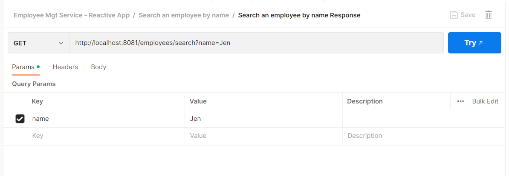
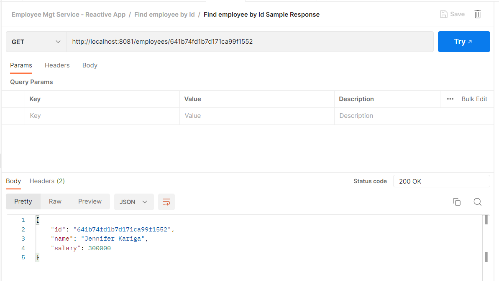
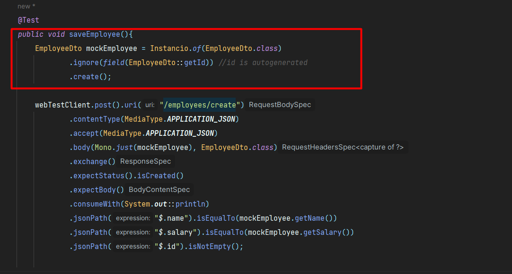

# Getting Started

## Employee Management System
This is a system meant to illustrate the microservice architecture under the Employee Management System.

Currently the microservices comprises of :

* Employee Service for Employee CRUD Operations

The services to be added later :
* API Gateway Service
* Authentication Service to handle authentication and authorization operations
* Notification Service for sending Emails and SMS
* Reports Engine Service for generating reports
* Calendar Service for scheduling and creating calendar events

This is an **Employee Management REST Micro Service** created using:
* Spring Webflux Application (Spring Reactive) - Flux vs Mono
* Spring Data Reactive Mongodb
* Mongodb Database

It is an improvement on the [previous project](https://github.com/IdahK/employee_mgt_system).In this new project, I have added service discovery using Spring Cloud Eureka.

This employee service is part of collection of micro-services (Notification Service, Calendar Service, Gateway Service, Administration Service, Configuration Service, Report Service etc) that are meant to communicate with each other. Using service discovery, these services are able to communicate to each other without having to hard-code **their names and port numbers**.
With Netflix Eureka, a client( a microservice) is able to fetch a list of all connected services from a service registry. From there, the microservice makes requests to the other connected services.You can read more on this [here](https://spring.io/guides/gs/service-registration-and-discovery/).

This project implements the following concepts:
* [Reactive Programming](https://www.baeldung.com/cs/reactive-programming)
* [Profiling](https://zetcode.com/springboot/profile/#:~:text=Spring%20Boot%20allows%20to%20define,only%20for%20the%20specified%20profile.)
* [Integration Testing](https://www.baeldung.com/spring-boot-testing)
* [REST Applications](https://spring.io/guides/gs/rest-service/)

**Reactive programming** is a design paradigm that allows development of **event-driven web applications** which are responsiive and scalable. It is based on Reactive Streams which handles streams of data which are asynchronous.

Why Spring Webflux? Well, reactive programming is achieved in Spring Webflux through the use of **Mono and Flux** classes which represent a **single or multiple values over time respectively**. 

Reactive programming helps to improve application performance by reducing thread blocking and minimal resource usage.
For example:

``
        public Flux<EmployeeDto> findAll() {
        return employeeRepository
        .findAll()
        .map(EmployeeMapper::mapToEmployeeDto)
        .switchIfEmpty(Flux.empty());
        }
``

This is a sample service method within this project that fetches all employees from our database.Here we are returning a Flux of Employees from Employees repository. This means that the method will stream employees as they become available rather than waiting for all employee data to be loaded before returning them.

### Run Application
**_Prerequisite_**: Ensure you have Mongodb installed on your machine. Can change the database and port details for your Mongodb instance in `application.properties` file located within the resources folder.

**_Instructions_**: Clone this project and run the application either using Eclipse or Intellij, the default port has been set to port 8081

Sample Endpoints:
1. Searching an employee by Name:

    

2. Find an employee by their Id:

   

Note:
For my tests, I have generated test data using Instancio Library as shown below:

Kindly import the postman collection to view and test the apis using:

<code><i>\employee-mgt-micro-services\employee-service\src\main\resources\Employee Management System.postman_collection.json</i></code>

### Reference Documentation

For further reference, please consider the following sections:

* [Official Apache Maven documentation](https://maven.apache.org/guides/index.html)
* [Spring Boot Maven Plugin Reference Guide](https://docs.spring.io/spring-boot/docs/3.0.4/maven-plugin/reference/html/)
* [Create an OCI image](https://docs.spring.io/spring-boot/docs/3.0.4/maven-plugin/reference/html/#build-image)
* [Spring Boot DevTools](https://docs.spring.io/spring-boot/docs/3.0.4/reference/htmlsingle/#using.devtools)
* [Spring Data Reactive MongoDB](https://docs.spring.io/spring-boot/docs/3.0.4/reference/htmlsingle/#data.nosql.mongodb)
* [Spring Reactive Web](https://docs.spring.io/spring-boot/docs/3.0.4/reference/htmlsingle/#web.reactive)

### Guides

The following guides illustrate how to use some features concretely:

* [Service Registration and Discovery with Eureka and Spring Cloud](https://spring.io/guides/gs/service-registration-and-discovery/)
* [Accessing Data with MongoDB](https://spring.io/guides/gs/accessing-data-mongodb/)
* [Building a Reactive RESTful Web Service](https://spring.io/guides/gs/reactive-rest-service/)
* [Building a RESTful Web Service with Spring Boot Actuator](https://spring.io/guides/gs/actuator-service/)
The following guides illustrate how to use some features concretely:

* [Accessing Data with MongoDB](https://spring.io/guides/gs/accessing-data-mongodb/)
* [Building a Reactive RESTful Web Service](https://spring.io/guides/gs/reactive-rest-service/)

